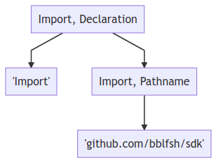
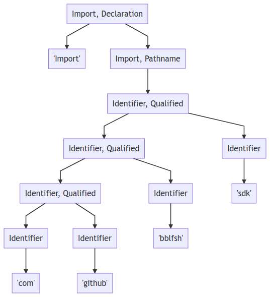

# UAST Specification

This page describes the legacy UASTv1 representation that will be deprecated.
See [UASTv2](./uast-v2.md) for the new version.

## Overview

A Universal Abstract Syntax Tree \(UAST\) is a normalized form of [Abstract Syntax Tree \(AST\)](https://en.wikipedia.org/wiki/Abstract_syntax_tree) with language-independent annotations. Its structure is as follows:

```go
type Node struct {
    InternalType  string
    Properties    map[string]string
    Children      []*Node
    Token         string
    StartPosition Position
    EndPosition   Position
    Roles         []Role
}
```

**Check out the godoc for the SDK** [**UAST package**](https://godoc.org/gopkg.in/bblfsh/sdk.v2/uast) for the full documentation of the UAST structure and annotations in Go.

**For other languages, check the** [**UAST protobuf definition**](https://github.com/bblfsh/sdk/blob/94e3b212553e761677da180f321d9a7a60ebec5f/uast/generated.proto)**.**

## Syntax Tree Structure

As a combination of the native AST's tree structure with language-independent annotations, the underlying node, **tree structure** and properties such as native / internal types are kept unchanged from what it is provided. Thus, even though there are some additions to the nodes such as the completion of offset or line numbers / columns, is not the responsibility of Babelfish's drivers to provide a language independent tree structure \(even if that would be possible\).

Note that this conservation of the tree structure could be relaxed or changed in future versions of the UAST and native drivers' definitions to provide normalized tree structures for some really common subtree structures.

## Internal Type

The **internal type** is the original node type. It is an arbitrary string and is language-dependent. For example, in Java it is the class of each node. It is meant to be used by annotation rules \(e.g. _annotate nodes with internal type_ `*ast.File` _with the role_ `PackageDeclaration`\).

## Properties

**Properties** is a map of language-dependent properties attached to a node. In some languages, nodes in the AST not only have children, but also other metadata on each node. That metadata is translated to properties. Properties can be used by annotation rules too.

## Token

The **token** field contains a token from the original source code. If it is not an empty string, it means that the node represents a token. In some languages, all tokens correspond to leaves in the tree, while in other languages, tokens can be attached to any node.

It is guaranteed that retrieving all tokens from a UAST by doing a pre-order traversal of the UAST, gives a list of tokens in the same order as in the original source code. The Go uast package provides the [Tokens](https://godoc.org/gopkg.in/bblfsh/sdk.v2/uast#Tokens) function to perform this operation.

## Positions

A **position** has the following structure:

```go
type Position struct {
    Offset uint32
    Line   uint32
    Col    uint32
}
```

**Offset** is the absolute byte offset of the position in the original source code. It is a 0-based index.

**Line** is the line number in the original source code. It is a 1-based index.

**Col** is the column number in the original source code, relative to a line. It is a 1-based index.

A position `(0, 0, 0)` means that position is not available. Native parsers MUST provide, at least, offset or line+col for positions when the native parser provides a position for the specific node. The UAST normalization process includes computing offset from line+col or line+col from offset, in cases where native parser does not provide both. So it is guaranteed that nodes in a UAST either have no position attached or they have a position with valid offset, line and col.

There are two possible positions on each node: **start position** and **end position**. Nodes with defined token SHOULD have, at least, start position, which correspond to the position of the first character of the token in the original source code. End position, if present in a token node, is the position of the last character of the token in the original source code.

Nodes that have no token might have start or end position, indicating the region of code covered by that node.

* **TODO: define relation with encodings**
* **TODO: disambiguate meaning of start and end position for non-leave nodes with token**

## Roles

UAST is annotated with **roles**. Roles are language-independent annotations that describe what nodes in the UAST do. You can check the [list of all roles](roles.md).

UAST from different languages have different structures, but role annotations allow to interpret some aspects independently of the language.

For example, let's take an import of a package. If we draw nodes with their role name and token \(those with simple quotes\), we might have something as the following:




Or we might have the following for a different language:



One way or the other, we can get the package identifier by retrieving all tokens under the `Import`, `Pathname` roles in pre-order.

As it is clear from this example, extracting meaningful information from UAST requires different tree operations for each role. The documentation and reference implementation of these operations are defined in the [uast](http://godoc.org/gopkg.in/bblfsh/sdk.v2/uast/) package of the SDK.

Note that each node can \(and most will\) have multiple roles. For example, a typical `if` control flow construct will be represented by a node that will have both an `If` role and also either a `Statement` role for some languages \(e.g. Go, Java\) or a `Expression` role for others \(e.g. Scala\). The `If` role will also appear in its immediate children, with some additional roles like `Condition` for the if condition, `Then` for the then clause, `Else` for the else clause \(if it exists\), etc.

* **TODO:** add more examples

## Annotation Rules

Each driver normalizer defines a set of **annotation rules**. These rules define how to add roles to nodes.

For example, in the Java normalizer, `Import` and `Pathname` roles are added to nodes that have the internal type `QualifiedName` \(Java-specific\) with a parent with internal type `ImportDeclaration` \(Java-specific\). For a full example, check the [annotation rules for the Java driver](https://godoc.org/github.com/bblfsh/java-driver/driver/normalizer#pkg-variables).

